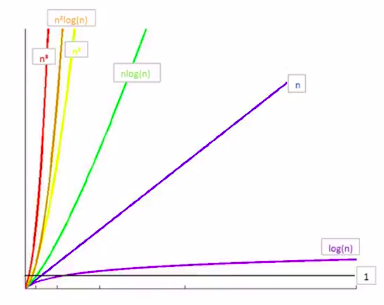

# Python数据结构与算法(b站视屏)
## 引入
* 算法是独立存在的一种解决问题的**方法**和**思想**
* 输入、输出、有穷性、确定性、可行性
* 时间复杂度
  * 大O表示法(渐进记法)
* 时间复杂度的计算法则
  1.基本操作，即只有常数项，认为时间复杂度位O(1)
  2.顺序结构，时间复杂度按照加法进行计算
  3.循环结构，时间复杂度按乘法进行计算
  4.分支结构，事件复杂度取最大值
  5.判断一个算法的效率，往往只需要关注数量的最高次项
  6.在没有特殊说明时，我们分析的算法的时间复杂度都是指最坏事件复杂度
* 常见的时间复杂度
  1.O(1)常数阶
  2.O(n)线性阶
  3.O(n^2)平方阶
  4.O(logn)对数阶
  5.O(nlogn)
  6.O(n^3)立方阶
  7.O(2^n)指数阶
  8.**注意**：logn一般是log2 n
   
* python内置类型性能分析
  1.timeit模块：测试执行速度
    * class timeit.Timer(stmt="pass",setup="pass",timer=<timer function>)
    * Timer是测量小段代码执行速度的类
    * stmt参数是要测试的代码语句(statment)
    * setup参数是运行代码时需要的设置
    * timer参数是一个定时器函数，与平台无关
  2.list内置操作的时间复杂度：
    * sort  O(nlogn) 其为Timsort算法
    * set slice  O(n+k)
  3.dict内置操作的时间复杂度
    * copy  O(n)
    * iteration  O(n)
## 数据结构 p1 4min
* 
* 
* 
* 
* 
* 
* 
* 
* 
* 

 