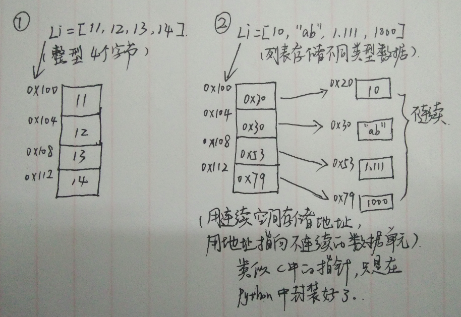
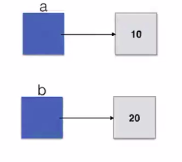

# Python数据结构与算法(b站视频)
## 引入
* 算法是独立存在的一种解决问题的**方法**和**思想**
* 输入、输出、有穷性、确定性、可行性
* 时间复杂度
  * 大O表示法(渐进记法)
* 时间复杂度的计算法则
  * 基本操作，即只有常数项，认为时间复杂度位O(1)
  * 顺序结构，时间复杂度按照加法进行计算
  * 循环结构，时间复杂度按乘法进行计算
  * 分支结构，事件复杂度取最大值
  * 判断一个算法的效率，往往只需要关注数量的最高次项
  * 在没有特殊说明时，我们分析的算法的时间复杂度都是指最坏事件复杂度
* 常见的时间复杂度
  * O(1)常数阶
  * O(n)线性阶
  * O(n^2)平方阶
  * O(logn)对数阶
  * O(nlogn)
  * O(n^3)立方阶
  * O(2^n)指数阶
  * **注意**：logn一般是log2 n
   
* python内置类型性能分析
  * timeit模块：测试执行速度
    * class timeit.Timer(stmt="pass",setup="pass",timer=<timer function>)
    * Timer是测量小段代码执行速度的类
    * stmt参数是要测试的代码语句(statment)
    * setup参数是运行代码时需要的设置
    * timer参数是一个定时器函数，与平台无关
  * list内置操作的时间复杂度：
    * sort  O(nlogn) 其为Timsort算法
    * set slice  O(n+k)
  * dict内置操作的时间复杂度
    * copy  O(n)
    * iteration  O(n)
## 数据结构 
###　顺序表
* 列表的下标从0开始
  * 其实这个0是偏移量
* python中顺序表的两种基本形式
  * 连续地址存储相同类型的数据
  * 类似指针的存储方式
   
* 顺序表的结构与实现
  * 一体式：表头信息和数据信息为连续内存
  * 分离式：表头信息和数据信息非连续存储
  * 元素存储区替换：
    * 一体式结构由于顺序表信息区和数据区存储在一起，所以若想要更换数据区，则只能整体进行搬迁，即申请新的地址空间来存储整个顺序表对象(存储顺序表的结构信息区域)
    * 分离式结构若想要更换数据区，只需要将表信息区中的数据区链接地址更新即可，而该顺序表对象不变

### 链表
* 单向链表
* 需要引一个python变量的概念：
  * a=10,b=20,其实开辟四个内存分别引用
  
* 
* 
* 
* 
* 
* 
* 
* 

 